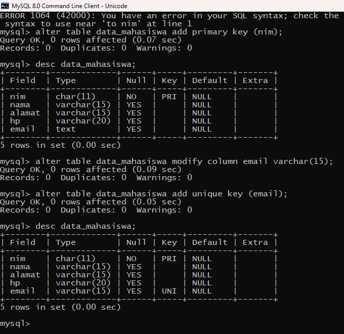

# data mahasiswa
<<<<<<< HEAD (current change)
 # 1. Buat sebuah database dengan nama latihan2!
mysql> create database latihan02;

=======
# 2. Buat sebuah tabel dengan nama biodata (nama, alamat) didalam database latihan1!

mysql>create table biodata (nama varchar (15), alamat varchar (15));

# 3. Tambahkan sebuah kolom keterangan (varchar 15), sebagai kolom terakhir!
mysql> alter table biodata add column keterangan varchar (15);
mysql> desc biodata

# 4. Tambahkan kolom id (int 11) di awal (sebagai kolom pertama)!
 mysql> alter table biodata add column id int(11) first;
 

# 5. Sisipkan sebuah kolom dengan nama phone (varchar 15) setelah kolom alamat!
mysql> alter table biodata add column phone varchar(15) after alamat;
mysql> desc biodata;

# 6. Ubah tipe data kolom id menjadi char(11)!
mysql> alter table biodata modify column id char (11);

# 7. Ubah nama kolom phone menjadi hp (varchar 20)!
mysql> alter table biodata change column phone hp varchar(20);
mysql> desc biodata;

# 8. Tambahkan kolom email setelah kolom hp!
mysql> alter table biodata add column email varchar(11) after hp;
mysql> desc biodata;

# 9. Hapus kolom keterangan dari tabel!
mysql> alter table biodata drop column keterangan;

# 10. Ganti nama tabel menjadi data_mahasiswa!
mysql> alter table biodata rename data_mahasiswa;
mysql> desc data_mahasiswa;

# 11. Ganti nama field id menjadi nim!
mysql> alter table data_mahasiswa change id nim;
mysql> desc data_mahasiswa;

# 12. Jadikan nim sebagai PRIMARY KEY!
mysql>  alter table data_mahasiswa add primary key (nim);
mysql> desc data_mahasiswa;

# 13. Jadikan kolom email sebagai UNIQUE KEY
mysql> alter table data_mahasiswa add unique key (email);
mysql> desc data_mahasiswa;

# C.	Data dan Analisis 
## 1.	Apa maksud dari Int (11)?
Maksud dari int (11) adalah nama tipe datanya adalah integer dan memiliki panjang 11 karakter.
## 2.	Ketika kita melihat sturktur tabel dengan perintah desc, ada kolom Null yang berisi Yes dan No, apa maksudnya?
Apabila Null berisi no, maka data tersebut nantinya akan dilakukan pengisian atau penginputan. Sedangkan apabila Null berisi yes, maka artinya data tersebut akan dikosongkan atau tidak dilakukan penginputan.
# -bd